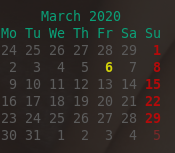

# Ejercicios de Go

## Ejercicio #1

Los múltiplos de 3 ó 5 inferiores a 10 son 3, 5, 6 y 9.

La suma de estos múltiplos es 23. Encontrar la suma de todos los mútliplos de 3
ó 5 menores que 1000.

NOTA: este es el primer problema de [Project Euler](http:projecteuler.net). No
hay ninguna intención de faltar a las normas de ese sitio, sino que se trata de
incentivar a otros a que jueguen allí.

### Ejemplo

``` sh
$ ./ex1 -bound 10
 The sum of all the multiples of 3 or 5 below 10 is 23
```

## Ejercicio #2

La prueba de divisibilidad de un número *n* entre 7 consiste en los siguientes
pasos:

1. Dividir el número *n* en dos partes: *n1* con todos los dígitos menos las
unidades; *n2* que consiste sólo en las unidades
2. If *(n1-n2)* es divisible entre 7 **STOP**, *n* es divisible entre 7
3. En otro caso, *n* es divisible entre 7 si y sólo si lo es *(n1-n2)*

### Ejemplo

``` sh
$ ./ex2 --number 870458270989
 The number 870458270989 is not divisible by 7 and the remainder, indeed is 6
$ ./ex2 --number 870458270990
 The number 870458270990 is divisible by 7!
```

## Ejercicio #3

Programar un paquete (*register*) que atienda peticiones de un pequeño servidor
HTTP en un puerto que debe indicarse como parámetro:

- Las peticiones a `"/"` deben simplemente dar la bienvenida al usuario
- Las peticiones a `"/timestamp"` deben mostrar la hora y fecha actual
- Las peticiones a `"/user"` deben mostrar el nombre de usuario actual

Para ello, el paquete debe ofrecer una única función exportable `Serve`

### Ejemplo

El servicio `Serve` podría usarse como sigue:

``` go
    register.Serve(port)
```

de modo que ejecutándolo:

``` sh
$ ./test --port 8080
```

cuando se abre el explorador en la dirección `localhost:8080` se ve:

``` text
Welcome to our tiny experimental server!
```

La dirección `localhost:8080/timestamp` podría devolver:

``` text
2020-02-24 17:49:31.623037828 +0100 CET m=+51.941346902
```

y, por último, la dirección `localhost:8080/user` devuelve:

``` text
clinares
```


## Ejercicio #4

Emular la funcionalidad del comando Unix ``comm``: dados dos ficheros ``FILE1``
y ``FILE2``, dividir los contenidos de ambos ficheros en columnas: la primera
columna debe mostrar sólo las líneas que aparecen en ``FILE1``, la segunda
columna sólo aquellas que aparezcan en el segundo fichero, y la tercera columna
las que aparecen en ambos. Además, el comando debe aceptar los siguientes
argumentos:

- ``1`` deshabilita la presentación de líneas en la primera columna
- ``2`` desactiva la presentación de la segunda columna
- ``3`` para no mostrar las líneas comunes en la tercera columna

El programa no debe asumir, como en el caso del comando Unix ``comm`` que la
entrada está ordenada, y las líneas pueden mostrarse en cualquier orden.

### Ejemplo

Dados los contenidos de dos ficheros:

``` sh
$ more data/file1.txt
Gottfried Leibniz
Gottlob Frege
Charles Babbage
Kurt Goedel
Alan Turing
Martin Davis

$ more data/file2.txt
Charles Babbage
Richard Stallman
Alan Turing
Martin Davis
Ken Thompson

```

Entonces las columnas generadas por el programa serían:

``` sh
$ ./ex4 -file1 data/file1.txt -file2 data/file2.txt
Gottfried Leibniz
Gottlob Frege
		Charles Babbage
Kurt Goedel
		Alan Turing
		Martin Davis
	Richard Stallman
	Ken Thompson
```

Por ejemplo, para ver sólo los contenidos comunes de ambos ficheros se puede
hacer:

``` sh
$ ./ex4 -file1 data/file1.txt -file2 data/file2.txt -1 -2
		Martin Davis
		Charles Babbage
		Alan Turing
```

Nótese que los argumentos se pasan como ``-1 -2`` y no como ``-12`` como en el
caso del comando Unix ``comm``.

## Ejercicio #5

Dado un nombre de usuario de [Lichess](http:lichess.org), obtener toda la
información pública de su perfil a través del servicio [REST API Get
`api/user/{username}`](https://lichess.org/api#operation/playerTopNbPerfType).

Es preciso tener en cuenta que la información devuelta por el servidor podrá
tener unos campos u otros en respuesta a información sobre usuarios diferentes
tal y como se muestra en los siguientes ejemplos.

### Ejemplo

Por ejemplo, con el usuario `clinares`:

``` sh
$ ./ex5 --user clinares

 clinares (Linares López, Carlos)

 * Madrid,ES

       Time spent
 total    7653528
    tv       2568

          # Games
      all   33689
     draw    1347
       ai       8
     winH   15054
    lossH   17280
      win   15056
       me       0
   import      67
    rated   33657
  playing       0
    drawH    1347
     loss   17286
 bookmark      33

        Variant Rating Incr.  Rd # Games
          blitz   1939   -24  45   32217
         bullet   1845   -43  62    1363
 correspondence   1489  -119 162      17
          horde   1321     0 251       5
         puzzle   1983   -49  80    1103
      classical   1883     0 252       2
          rapid   2182   -22 107      47
       chess960   1830     0 229       4

 * Completion rate: 90%

 * Following: 27
 * Followers: 51

 * Online: false
```

y, con otro usuario diferente la salida es:

``` sh
$ ./ex5 --user atorralba

 atorralba 

 * ES

       Time spent
 total    5678838
    tv     131301

          # Games
  playing       0
 bookmark       3
      win   12909
     winH   12906
       me       0
    drawH     894
    lossH    8509
   import       0
       ai      33
      all   22342
     draw     899
     loss    8534
    rated   22293

        Variant Rating Incr.  Rd # Games
  kingOfTheHill   1946   -13 108     273
         puzzle   2073    73  68    6268
          blitz   2199     5  45   10440
    racingKings   1746   -29 154      34
     threeCheck   1867    -2 129     127
     crazyhouse   1939    54 129     475
         atomic   1686  -115 118      44
          rapid   2108    32 105     185
          horde   1886    24 138     146
      classical   2043   -13 153      30
 correspondence   2184   251 139      26
         bullet   2010   -51  56    8956
       chess960   1881   -24  61    1294
    ultraBullet   1534   -29 110     115
      antichess   1757   -38 139     132

 * Completion rate: 97%

 * Following: 8
 * Followers: 10

 * Online: false
```

## Ejercicio #6

Implementar una versión mejorada del comando Unix ``cal`` que muestra un
calendario en diferentes intervalos temporales. Los argumentos básicos que debe
reconocer son:

- ``-1`` muestra únicamente un mes
- ``-3`` muestra el mes anterior y el siguiente al actual
- ``--months NUMBER`` muestra el número de meses indicado a partir de la fecha
  de inicio
- ``sunday`` fuerza el domingo como primer día de la semana que, por
  defecto, empiezan los lunes.
- ``week-numbering`` numera todas las semanas de cada año

Además, el comando Unix ``cal`` muestra los calendarios en bloques de tres
meses. Se sugiere implementar un argumento adicional para poder mostrarlos en
bloques de cualquier tamaño:

- ``blocks NUMBER`` para mostrar bloques de un tamaño arbitrario

Por último, la salida debe mostrar en diferentes colores la fecha actual o una
fecha proporcionada por el usuario. También pueden distinguirse los domingos del
resto de la semana y cualesquiera otras leyendas como el nombre del mes o los
días de la semana. Por lo tanto, debe proporcionarse también el argumento:

- ``disable-highlighting`` para mostrar el calendario en el mismo color. Las
  fechas que se resaltan de otras (esto es, la fecha actual y la que proporcione
  el usuario si entrega alguna), se deben mostrar en vídeo inverso.

### Ejemplo

Ejecutando el programa sin argumentos, se debe mostrar únicamente el mes con la
fecha actual:

``` sh
$ ./ex6
```



El mismo calendario puede mostrarse pero en bloques de 4 meses como se indica a
continuación

``` sh
$ ./ex6 --blocks 4 2020
```


En el siguiente ejemplo se muestra el mismo calendario pero en bloques de 5
meses y numerando todas las semanas:

``` sh
$ ./ex6 --blocks 5 --week-numbering 2020
```


Por último, si se entrega una fecha en particular entonces debe resaltarse. El
siguiente ejemplo muestra tres meses consecutivos con la fecha elegida en el mes
mostrado en el centro:

``` sh
$ ./ex6 -3 16 8 2010
```


## Ejercicio #7

El *Juego de Conway* se desarrolla sobre una rejilla de cualquier *alto* y
*ancho*. Se inicia con una población de *tamaño* arbitraria distribuída
aleatoriamente sobre la rejilla, y evoluciona durante un número de
*generaciones*. En cada generación, el estado de cada casilla, viva o muerta, se
determina con las siguientes reglas:

1. Una célula muerta con exactamente 3 células vecinas vivas *nace*, es decir,
   al turno siguiente estará viva.
   
2. Una célula viva con 2 ó 3 células vecinas vivas sigue viva, en otro caso
   muere, ya sea por *soledad* o *superpoblación*.
   
donde cada casilla tiene hasta 8 casillas adyacentes vecinas, es decir, en
horizontal, vertical o diagonal.

Para mostrar la animación se sugiere generar una imagen GIF con cualquier
retardo entre imágenes sucesivas


### Ejemplo

Los parámetros del programa son:

``` sh
$ ./ex7 --help
  -delay int
    	delay between frames in 100th of a second (default 1)
  -filename string
    	name of the GIF file (default "conway.gif")
  -generations int
    	number of generations (default 100)
  -height int
    	Height of the grid (default 100)
  -population int
    	initial population (default 100)
  -version
    	shows version info and exits
  -width int
    	Width of the grid (default 100)
```

de modo que, por ejemplo, para generar una animación de 1000 generaciones sobre
una rejilla de 100x100 con 6500 células vivas distribuidas aleatoriamente:

``` sh
$ ./ex7 --filename conway-100.100-1.gif --generations 1000 --height 100 --width 100 --population 6500
```

se generaría la siguiente imagen:


Para demostrar el efecto del cambio de velocidad, el comando:

``` sh
$ ./ex7 --filename conway-100.100-50.gif --generations 1000 --height 100 --width 100 --population 6500 --delay 50
```

produciría una simulación como la siguiente:


Por último, la siguiente imagen se desarrolla sobre un rectángulo 9 veces más
ancho que alto con el mínimo delay (sólo 1/100 segundos):

``` sh
$ ./ex7 --filename conway-900-100-1.gif --generations 1000 --height 100 --width 900 --population 60000
```


# License #

goex is free software: you can redistribute it and/or modify it under
the terms of the GNU General Public License as published by the Free
Software Foundation, either version 3 of the License, or (at your
option) any later version.

goex is distributed in the hope that it will be useful, but WITHOUT
ANY WARRANTY; without even the implied warranty of MERCHANTABILITY or
FITNESS FOR A PARTICULAR PURPOSE.  See the GNU General Public License
for more details.

You should have received a copy of the GNU General Public License
along with goex.  If not, see <http://www.gnu.org/licenses/>.


# Author #

Carlos Linares Lopez <carlos.linares@uc3m.es>
