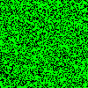
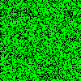

# Ejercicio #7

El *Juego de Conway* se desarrolla sobre una rejilla de cualquier *alto* y
*ancho*. Se inicia con una población de *tamaño* arbitraria distribuída
aleatoriamente sobre la rejilla, y evoluciona durante un número de
*generaciones*. En cada generación, el estado de cada casilla, viva o muerta, se
determina con las siguientes reglas:

1. Una célula muerta con exactamente 3 células vecinas vivas *nace*, es decir,
   al turno siguiente estará viva.
   
2. Una célula viva con 2 ó 3 células vecinas vivas sigue viva, en otro caso
   muere, ya sea por *soledad* o *superpoblación*.
   
donde cada casilla tiene hasta 8 casillas adyacentes vecinas, es decir, en
horizontal, vertical o diagonal.

Para mostrar la animación se sugiere generar una imagen GIF con cualquier
retardo entre imágenes sucesivas


## Ejemplo

Los parámetros del programa son:

``` sh
$ ./ex7 --help
  -delay int
    	delay between frames in 100th of a second (default 1)
  -filename string
    	name of the GIF file (default "conway.gif")
  -generations int
    	number of generations (default 100)
  -height int
    	Height of the grid (default 100)
  -population int
    	initial population (default 100)
  -version
    	shows version info and exits
  -width int
    	Width of the grid (default 100)
```

de modo que, por ejemplo, para generar una animación de 1000 generaciones sobre
una rejilla de 100x100 con 6500 células vivas distribuidas aleatoriamente:

``` sh
$ ./ex7 --filename conway-100.100-1.gif --generations 1000 --height 100 --width 100 --population 6500
```

se generaría la siguiente imagen:



Para demostrar el efecto del cambio de velocidad, el comando:

``` sh
$ ./ex7 --filename conway-100.100-50.gif --generations 1000 --height 100 --width 100 --population 6500 --delay 50
```

produciría una simulación como la siguiente:



Por último, la siguiente imagen se desarrolla sobre un rectángulo 9 veces más
ancho que alto con el mínimo delay (sólo 1/100 segundos):

``` sh
$ ./ex7 --filename conway-900-100-1.gif --generations 1000 --height 100 --width 900 --population 60000
```


# License #

goex is free software: you can redistribute it and/or modify it under
the terms of the GNU General Public License as published by the Free
Software Foundation, either version 3 of the License, or (at your
option) any later version.

goex is distributed in the hope that it will be useful, but WITHOUT
ANY WARRANTY; without even the implied warranty of MERCHANTABILITY or
FITNESS FOR A PARTICULAR PURPOSE.  See the GNU General Public License
for more details.

You should have received a copy of the GNU General Public License
along with goex.  If not, see <http://www.gnu.org/licenses/>.


# Author #

Carlos Linares Lopez <carlos.linares@uc3m.es>
